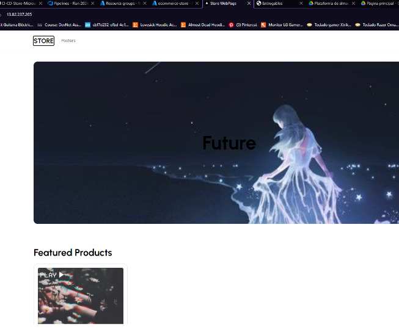

# Creando una infraestructura de microservicios en azure con terraform


En este proyecto, se creará una infraestructura desplegada en la nube de Azure utilizando Terraform. Esta infraestructura incluirá varios microservicios que estarán contenerizados con Docker y desplegados con Kubernetes en Azure. Además, se utilizará Azure DevOps para activar pipelines cuando se modifique el código de algún microservicio, permitiendo así desplegar la versión más reciente del microservicio en la nube. La gestión de secretos se realizará mediante Azure Key Vault, y el acceso a los microservicios se hará a través de un API Gateway que se conectará al Ingress del clúster de Azure, facilitando la conectividad hacia los microservicios.


# Diagrama de infraestructura

Se seguira el siguiente diagrama de infraestructura para desplegar en azure usando terraform


<p align="center">
  
</p>


### Descripción General

Este diagrama representa la arquitectura de una aplicación de comercio electrónico desplegada en Azure utilizando Kubernetes y varios servicios auxiliares.

### Componentes Principales

1. **Azure Resource Group**
   - Contiene todos los recursos de Azure relacionados con esta arquitectura.

2. **Virtual Network**
   - Provee la red en la que todos los componentes de la arquitectura se comunican.

3. **Kubernetes Cluster**
   - **Namespaces**:
     - `frontend_ns`: 
       - `e-commerce_store`: despliegues y pods para la tienda.
       - `e-commerce_admin`: despliegues y pods para la administración.
     - `storage_ns`:
       - `e-commerce_storage`: gestión de almacenamiento persistente.
     - `util-services_ns`:
       - `prometheus` y `grafana`: servicios de monitoreo y visualización.

4. **Azure API Gateway**
   - Actúa como punto de entrada para los usuarios y dirige el tráfico a los servicios adecuados dentro del clúster de Kubernetes.

5. **Azure Key Vault**
   - Gestiona secretos y credenciales seguras.

6. **Managed Identities**
   - Provee identidades administradas para acceso seguro a los recursos de Azure.

7. **Ingress Controller**
   - Gestiona el enrutamiento de las solicitudes HTTP/S hacia los servicios en el clúster de Kubernetes.

8. **CI/CD Pipeline**
   - Automatización del despliegue continuo y la integración continua.
   - `Azure DevOps`: herramienta de CI/CD.
   - `Container Registry`: almacén de imágenes de contenedores.

9. **Servicios Externos**
   - **Cloudinary**: gestión de imágenes.
   - **Stripe**: procesamiento de pagos.
   - **GitHub**: repositorio de código.
   - **Client Authentication**: autenticación de usuarios.

10. **Roles**
    - **Operaciones**
    - **Desarrolladores**

### Flujo de Trabajo

1. **Usuario**:
   - Hace una solicitud a través del `Azure API Gateway`.

2. **Azure API Gateway**:
   - Redirige la solicitud al `Ingress Controller` en el clúster de Kubernetes.

3. **Ingress Controller**:
   - Dirige la solicitud al servicio apropiado (`e-commerce_store` o `e-commerce_admin`).

4. **Servicios en el clúster de Kubernetes**:
   - Gestionan las solicitudes y responden a través del `Ingress Controller` y `API Gateway`.

5. **CI/CD Pipeline**:
   - Desarrolladores realizan cambios en `GitHub`.
   - El pipeline CI/CD en `Azure DevOps` despliega nuevas versiones a `Container Registry` y actualiza los despliegues en Kubernetes.

6. **Monitoreo y Visualización**:
   - `Prometheus` y `Grafana` supervisan y visualizan el estado del clúster y las aplicaciones.

7. **Acceso Seguro**:
   - `Azure Key Vault` proporciona credenciales seguras a través de `Managed Identities`.

### Interacciones Adicionales

- **Operaciones** y **Desarrolladores** interactúan con los componentes del CI/CD pipeline para mantener y desplegar nuevas versiones de la aplicación.
- **Servicios Externos** como `Cloudinary` y `Stripe` se integran con la aplicación para funcionalidades específicas (gestión de imágenes y procesamiento de pagos).


# Procedimiento

Para explicar este proyecto, se procedera a dividir por modulos el mismo, modulos en base a los recursos que se necesiten para desplegar en azure y hacer funcional dicho diagrama de infraestructura, para el proyecto entonces se necesitan los siguientes modulos

<p align="center">
  
</p>

Cabe destacar que cada modulo necesita tener 3 clases, una `main.tf` , `outputs.tf` y `variables.tf`

## Cluster de Azure


El codigo encontrado en [modules/aks_cluster](modules/aks_cluster/main.tf) se utiliza para crear un clúster de Azure Kubernetes Service (AKS) y generar un archivo de configuración de Kubernetes (kubeconfig) local.

### Recursos creados

1. **azurerm_kubernetes_cluster**: Crea un clúster de AKS con las siguientes características:
   - Nombre del clúster
   - Ubicación
   - Grupo de recursos
   - Prefijo DNS
   - Configuración del grupo de nodos predeterminado:
     - Nombre del grupo de nodos
     - Número de nodos
     - Tamaño de la máquina virtual
     - Tamaño del disco del sistema operativo
     - ID de subred de la red virtual
   - Perfil de red:
     - Plugin de red
   - Identidad:
     - Tipo de identidad
   - Proveedor de secretos de Key Vault:
     - Rotación de secretos habilitada

2. **local_file**: Genera un archivo local con el contenido del archivo de configuración de Kubernetes (kubeconfig) del clúster AKS creado.

### Variables

| Variable | Descripción |
| --- | --- |
| `cluster_name` | Nombre del clúster AKS |
| `resource_group_name` | Nombre del grupo de recursos |
| `location` | Ubicación del clúster |
| `dns_prefix` | Prefijo DNS del clúster |
| `node_pool_name` | Nombre del grupo de nodos |
| `node_count` | Número de nodos en el grupo de nodos |
| `vm_siz` | Tamaño de la máquina virtual de los nodos |
| `os_disk_size_gb` | Tamaño del disco del sistema operativo de los nodos |
| `vnet_subnet_id` | ID de subred de la red virtual |
| `network_plugin` | Plugin de red utilizado |
| `identity_type` | Tipo de identidad utilizada |
| `local_file_name` | Nombre del archivo local para el kubeconfig |
| `secret_rotation_enabled` | Indica si la rotación de secretos está habilitada |

### Outputs

| Output | Descripción |
| --- | --- |
| `aks_cluster_id` | ID del clúster AKS |
| `cluster_name` | Nombre del clúster AKS |
| `client_id` | ID de cliente de la identidad del proveedor de secretos de Key Vault |
| `host` | Host del clúster Kubernetes |
| `client_certificate` | Certificado del cliente para autenticación |
| `client_key` | Clave del cliente para autenticación |
| `cluster_ca_certificate` | Certificado de la autoridad certificadora del clúster |
| `principal_id` | ID del objeto de la identidad de Kubelet |
| `secret_provider` | ID del objeto de la identidad del proveedor de secretos |

## Application Gateway en azure

El codigo encontrado en [modules/application_gateway](modules/application_gateway/main.tf) se utiliza para crear un Application Gateway de Azure y configurarlo con las siguientes características:

### Recursos creados

1. **azurerm_application_gateway**: Crea un Application Gateway con las siguientes características:
   - Nombre del Application Gateway
   - Grupo de recursos
   - Ubicación
   - Configuración del SKU:
     - Nombre del SKU
     - Nivel del SKU
     - Capacidad del SKU
   - Configuración de la configuración de IP de gateway:
     - Nombre de la configuración de IP de gateway
     - ID de subred
   - Configuración de la configuración de IP frontal:
     - Nombre de la configuración de IP frontal
     - ID de dirección IP pública
   - Configuración del puerto frontal:
     - Nombre del puerto frontal
     - Número de puerto
   - Configuración de la piscina de direcciones de backend:
     - Nombre de la piscina de direcciones de backend
   - Configuración de los ajustes de HTTP de backend:
     - Nombre de los ajustes de HTTP de backend
     - Affinidad basada en cookies
     - Puerto de los ajustes de HTTP de backend
     - Protocolo de los ajustes de HTTP de backend
     - Tiempo de espera de solicitud de los ajustes de HTTP de backend
   - Configuración del escuchador HTTP:
     - Nombre del escuchador HTTP
     - Configuración de IP frontal asociada
     - Configuración de puerto frontal asociada
     - Protocolo del escuchador HTTP
   - Configuración de la regla de routing de solicitud:
     - Nombre de la regla de routing de solicitud
     - Tipo de regla de routing de solicitud
     - Prioridad de la regla de routing de solicitud
     - Escuchador HTTP asociado
     - Piscina de direcciones de backend asociada
     - Ajustes de HTTP de backend asociados

### Variables

| Variable | Descripción |
| --- | --- |
| `application_gateway_name` | Nombre del Application Gateway |
| `resource_group_name` | Nombre del grupo de recursos |
| `location` | Ubicación del Application Gateway |
| `sku_name` | Nombre del SKU del Application Gateway |
| `sku_tier` | Nivel del SKU del Application Gateway |
| `sku_capacity` | Capacidad del SKU del Application Gateway |
| `gateway_ip_configuration_name` | Nombre de la configuración de IP de gateway |
| `subnet_id` | ID de subred para el Application Gateway |
| `frontend_ip_configuration_name` | Nombre de la configuración de IP frontal |
| `public_ip_address_id` | ID de dirección IP pública para la configuración de IP frontal |
| `frontend_port_name` | Nombre del puerto frontal |
| `frontend_port_port` | Número de puerto del puerto frontal |
| `backend_address_pool_name` | Nombre de la piscina de direcciones de backend |
| `backend_http_settings_name` | Nombre de los ajustes de HTTP de backend |
| `cookie_based_affinity` | Affinidad basada en cookies para los ajustes de HTTP de backend |
| `backend_http_settings_port` | Puerto de los ajustes de HTTP de backend |
| `backend_http_settings_protocol` | Protocolo de los ajustes de HTTP de backend |
| `backend_http_settings_request_timeout` | Tiempo de espera de solicitud de los ajustes de HTTP de backend |
| `http_listener_name` | Nombre del escuchador HTTP |
| `http_listener_frontend_ip_configuration_name` | Configuración de IP frontal asociada al escuchador HTTP |
| `http_listener_frontend_port_name` | Configuración de puerto frontal asociada al escuchador HTTP |
| `http_listener_protocol` | Protocolo del escuchador HTTP |
| `request_routing_rule_name` | Nombre de la regla de routing de solicitud |
| `request_routing_rule_rule_type` | Tipo de regla de routing de solicitud |
| `request_routing_rule_priority` | Prioridad de la regla de routing de solicitud |
| `request_routing_rule_http_listener_name` | Escuchador HTTP asociado a la regla de routing de solicitud |
| `request_routing_rule_backend_address_pool_name` | Piscina de direcciones de backend asociada a la regla de routing de solicitud |
| `request_routing_rule_backend_http_settings_name` | Ajustes de HTTP de backend asociados a la regla de routing de solicitud |

### Outputs

| Output | Descripción |
| --- | --- |
| `application_gateway_id` | ID del Application Gateway |
| `application_gateway_name` | Nombre del Application Gateway |

## Bastion Host

El codigo encontrado en [modules/bastion_host](modules/bastion_host/main.tf) se utiliza para crear un host de bastión de Azure y configurarlo con las siguientes características:

### Recursos creados

1. **azurerm_bastion_host**: Crea un host de bastión de Azure con las siguientes características:
   - Nombre del host de bastión
   - Ubicación
   - Grupo de recursos
   - Configuración del SKU
   - Configuración de la configuración de IP:
     - Nombre de la configuración de IP
     - ID de subred
     - ID de dirección IP pública
   - Configuración de las características de copia y compartimiento:
     - Copia y compartimiento habilitados
     - Compartimiento de enlaces compartidos
     - Compartimiento de túneles

### Variables

| Variable | Descripción |
| --- | --- |
| `bastion_name` | Nombre del host de bastión |
| `resource_group_location` | Ubicación del grupo de recursos |
| `resource_group_name` | Nombre del grupo de recursos |
| `ip_configuration_name` | Nombre de la configuración de IP |
| `cluster_subnet_id` | ID de subred para el host de bastión |
| `bastion_public_ip` | ID de dirección IP pública asociada al host de bastión |
| `sku` | SKU del host de bastión |

### Outputs

| Output | Descripción |
| --- | --- |
| `name` | Nombre del host de bastión |

Este código crea un host de bastión de Azure con configuración de IP y características de copia y compartimiento habilitadas.

## Container Registry en Azure

El codigo encontrado en [modules/container_registry](modules/container_registry/main.tf) se utiliza para crear un registro de contenedores de Azure y configurarlo con las siguientes características:

### Recursos creados

1. **azurerm_container_registry**: Crea un registro de contenedores de Azure con las siguientes características:
   - Nombre del registro de contenedores
   - Grupo de recursos
   - Ubicación
   - Configuración del SKU
   - Estado de administrador habilitado

### Variables

| Variable | Descripción |
| --- | --- |
| `container_name` | Nombre del registro de contenedores |
| `resource_group_name` | Nombre del grupo de recursos |
| `resource_group_location` | Ubicación del grupo de recursos |
| `container_sku` | SKU del registro de contenedores |
| `admin_enabled` | Estado de administrador habilitado |

### Outputs

| Output | Descripción |
| --- | --- |
| `scope` | ID del registro de contenedores |
| `name` | Nombre del registro de contenedores |

Este código crea un registro de contenedores de Azure con configuración de SKU y estado de administrador habilitado.

## Azure Identity

El codigo encontrado en [modules/identity](modules/identity/main.tf) se utiliza para crear una identidad asignada por usuario de Azure y configurarla con las siguientes características:

### Recursos creados

1. **azurerm_user_assigned_identity**: Crea una identidad asignada por usuario de Azure con las siguientes características:
   - Nombre de la identidad
   - Grupo de recursos
   - Ubicación

### Variables

| Variable                | Descripción                                    |
|-------------------------|------------------------------------------------|
| `name`                | Nombre de la identidad asignada por usuario      |
| `resource_group_name` | Nombre del grupo de recursos                  |
| `location`            | Ubicación/Región donde se creará la identidad |


### Outputs

| Output | Descripción |
| --- | --- |
| `client_id` | ID del cliente de la identidad asignada por usuario |
| `principal_id` | ID principal de la identidad asignada por usuario |
| `id` | ID de la identidad asignada por usuario |

## Key Vault

El codigo encontrado en [modules/key_vault](modules/key_vault/main.tf) se utiliza para crear un almacén de claves de Azure y configurarla con las siguientes características:

### Recursos creados

1. **azurerm_key_vault**: Crea un almacén de claves de Azure con las siguientes características:
   - Nombre del almacén de claves
   - Ubicación
   - Grupo de recursos
   - Tenant ID
   - Configuración de retención de eliminación suave
   - Configuración de SKU
   - Configuración de permisos de acceso
   - Configuración de políticas de acceso

2. **azurerm_key_vault_secret**: Crea secretos en el almacén de claves de Azure con las siguientes características:
   - Nombre del secreto
   - Valor del secreto
   - ID del almacén de claves

3. **random_password**: Genera una contraseña aleatoria con las siguientes características:
   - Longitud de la contraseña
   - Número de caracteres mayúsculos
   - Número de caracteres minúsculos
   - Número de caracteres numéricos
   - Número de caracteres especiales

### Outputs

| Output | Descripción |
| --- | --- |
| `key_vault_id` | ID del almacén de claves |
| `name` | Nombre del almacén de claves |
| `tenant_id` | Tenant ID del almacén de claves |
| `secrets` | Valores de los secretos del almacén de claves |
| `linuxVM_pswd` | Contraseña generada aleatoriamente para el VM Linux |

### Variables

| Variable                | Descripción                                    |
|-------------------------|------------------------------------------------|
| `key_vault_name`          | Nombre del almacén de claves                     |
| `resource_group_name`     | Nombre del grupo de recursos                   |
| `location`               | Ubicación del almacén de claves                |
| `tenant_id`               | Tenant ID del almacén de claves                |
| `soft_delete_retention_days` | Período de retención de eliminación suave      |
| `sku_name`                | Nombre del SKU del almacén de claves            |
| `object_id`               | ID del objeto del almacén de claves            |
| `key_permissions`         | Permisos de clave del almacén de claves         |
| `secret_permissions`      | Permisos de secreto del almacén de claves      |
| `certificate_permissions` | Permisos de certificado del almacén de claves |
| `secret_names`            | Nombres de los secretos del almacén de claves  |
| `secret_values`           | Valores de los secretos del almacén de claves  |
| `user_assigned_identity_principal_id` | ID del objeto del identidad asignada por usuario |
| `aks_secret_provider_id` | ID del proveedor de secretos de AKS          |
| `purge_protection_enabled` | Protección de eliminación suave habilitada      |
| `enabled_for_disk_encryption` | Habilitado para la cifrado de disco          |

Este código crea un almacén de claves de Azure con configuración de permisos de acceso y secreto, y también crea secretos en el almacén de claves con valores generados aleatoriamente.

## Networking

El codigo encontrado en [modules/networking](modules/networking/main.tf) se utiliza para crear una infraestructura de red en Azure con las siguientes características:

### Recursos creados

1. **azurerm_public_ip**: Crea dos direcciones IP públicas de Azure:
   - Una para el API Gateway
   - Otra para el bastión

2. **azurerm_virtual_network**: Crea dos redes virtuales de Azure:
   - Una para el API Gateway
   - Otra para el clúster

3. **azurerm_subnet**: Crea tres subredes de Azure:
   - Una para el API Gateway
   - Otra para el clúster
   - Otra para el bastión

4. **azurerm_virtual_network_peering**: Crea dos emparejamientos de redes virtuales de Azure:
   - Uno desde el API Gateway hasta el clúster
   - Otro desde el clúster hasta el API Gateway

### Outputs

| Output | Descripción |
| --- | --- |
| `public_ip_id` | ID de la dirección IP pública del API Gateway |
| `bastionip` | ID de la dirección IP pública del bastión |
| `bastion_ip_address` | Dirección IP del bastión |
| `api_vnet_name` | Nombre de la red virtual del API Gateway |
| `api_vnet_id` | ID de la red virtual del API Gateway |
| `api_gateway_subnet_id` | ID de la subred del API Gateway |
| `cluster_vnet_id` | ID de la red virtual del clúster |
| `cluster_subnet_id` | ID de la subred del clúster |
| `bastion_subnet_id` | ID de la subred del bastión |

### Variables

| Variable                | Descripción                                    |
|-------------------------|------------------------------------------------|
| `resource_group_name`     | Nombre del grupo de recursos de Azure          |
| `location`               | Ubicación de los recursos de Azure             |
| `public_ip_name`          | Nombre de la dirección IP pública del API Gateway |
| `bastion_public_ip_name`   | Nombre de la dirección IP pública del bastión    |
| `allocation_method`       | Método de asignación de la dirección IP pública |
| `sku`                     | SKU de la dirección IP pública                |
| `api_vnet_name`           | Nombre de la red virtual del API Gateway       |
| `api_vnet_address_space`  | Espacio de direcciones de la red virtual del API Gateway |
| `api_gateway_subnet_name`  | Nombre de la subred del API Gateway          |
| `api_gateway_subnet_address_prefixes` | Prefijos de direcciones de la subred del API Gateway |
| `cluster_vnet_name`        | Nombre de la red virtual del clúster          |
| `cluster_vnet_address_space` | Espacio de direcciones de la red virtual del clúster |
| `cluster_subnet_name`       | Nombre de la subred del clúster             |
| `cluster_subnet_address_prefixes` | Prefijos de direcciones de la subred del clúster |
| `appgw_to_cluster_peering_name` | Nombre del emparejamiento de redes virtuales desde el API Gateway hasta el clúster |
| `cluster_to_appgw_peering_name` | Nombre del emparejamiento de redes virtuales desde el clúster hasta el API Gateway |
| `bastion_subnet_address_prefixes` | Prefijos de direcciones de la subred del bastión |

Este código crea una infraestructura de red en Azure con dos redes virtuales, tres subredes y dos emparejamientos de redes virtuales.

## Resource Group

El codigo encontrado en [modules/resource_group](modules/resource_group/main.tf) se utiliza para crear un grupo de recursos de Azure y configurarla con las siguientes características:

### Recursos creados

1. **azurerm_resource_group**: Crea un grupo de recursos de Azure con las siguientes características:
   - Nombre del grupo de recursos
   - Ubicación del grupo de recursos

### Outputs

| Output | Descripción |
| --- | --- |
| `resource_group_id` | ID del grupo de recursos |
| `resource_group_name` | Nombre del grupo de recursos |
| `location` | Ubicación del grupo de recursos |

### Variables

| Variable                | Descripción                                    |
|-------------------------|------------------------------------------------|
| `resource_group_name`     | Nombre del grupo de recursos de Azure          |
| `location`               | Ubicación del grupo de recursos de Azure        |

Este código crea un grupo de recursos de Azure con configuración de nombre y ubicación.

## Role Assignment

El codigo encontrado en [modules/role_assignment](modules/role_assignment/main.tf) se utiliza para asignar roles de Azure y configurarlos con las siguientes características:

### Recursos creados

1. **azurerm_role_assignment**: Asigna un rol de Azure con las siguientes características:
   - ID del objeto principal
   - Nombre del rol
   - Ámbito del rol
   - Opción para saltar la verificación de la cuenta de servicio principal de Azure Active Directory

2. **azurerm_role_assignment**: Asigna otro rol de Azure con las siguientes características:
   - Ámbito del rol
   - Nombre del rol
   - ID del objeto principal

### Variables

| Variable                | Descripción                                    |
|-------------------------|------------------------------------------------|
| `principal_id`          | ID del objeto principal                     |
| `role_definition_name`  | Nombre del rol                              |
| `scope`                | Ámbito del rol                              |
| `skip_service_principal_aad_check` | Opción para saltar la verificación de la cuenta de servicio principal de Azure Active Directory |
| `scope_key_vault`       | Ámbito del rol para el almacén de claves    |
| `role_definition_name_key_vault` | Nombre del rol para el almacén de claves |
| `principal_id_key_vault` | ID del objeto principal para el almacén de claves |

Este código asigna roles de Azure y configura los ámbitos y los nombres de los roles.

## Security Group

El codigo encontrado en [modules/security_group](modules/security_group/main.tf) se utiliza para crear un grupo de seguridad de red (NSG) de Azure y configurarla con las siguientes características:

### Recursos creados

1. **azurerm_network_security_group**: Crea un grupo de seguridad de red (NSG) de Azure con las siguientes características:
   - Nombre del grupo de seguridad de red
   - Ubicación del grupo de seguridad de red
   - Grupo de recursos del grupo de seguridad de red
   - Regla de seguridad de red

### Outputs

| Output | Descripción |
| --- | --- |
| `name` | Nombre del grupo de seguridad de red |
| `id` | ID del grupo de seguridad de red |

### Variables

| Variable                | Descripción                                    |
|-------------------------|------------------------------------------------|
| `name`                | Nombre del grupo de seguridad de red          |
| `resource_group_location` | Ubicación del grupo de seguridad de red     |
| `resource_group_name`   | Grupo de recursos del grupo de seguridad de red |
| `security_name`         | Nombre de la regla de seguridad de red      |
| `security_priority`     | Prioridad de la regla de seguridad de red  |
| `security_direction`    | Dirección de la regla de seguridad de red  |
| `security_access`       | Acceso de la regla de seguridad de red     |
| `security_protocol`     | Protocolo de la regla de seguridad de red  |
| `security_source_port_range` | Rango de puertos de origen de la regla de seguridad de red |
| `security_destination_port_range` | Rango de puertos de destino de la regla de seguridad de red |
| `security_source_address_prefix` | Prefijo de dirección de origen de la regla de seguridad de red |
| `security_destination_address_prefix` | Prefijo de dirección de destino de la regla de seguridad de red |

Este código crea un grupo de seguridad de red (NSG) de Azure con una regla de seguridad de red que permite el tráfico de red según las especificaciones proporcionadas.


## Virtual Machine en Azure

El codigo encontrado en [modules/vm](modules/vm/main.tf) se utiliza para crear una máquina virtual de Linux en Azure y configurarla con las siguientes características:

### Recursos creados

1. **azurerm_linux_virtual_machine**: Crea una máquina virtual de Linux en Azure con las siguientes características:
   - Nombre de la máquina virtual
   - Ubicación de la máquina virtual
   - Grupo de recursos de la máquina virtual
   - Tamaño de la máquina virtual
   - Configuración de la red de la máquina virtual
   - Configuración de la autenticación de la máquina virtual
   - Configuración de la imagen de la máquina virtual

2. **azurerm_network_interface**: Crea una interfaz de red de Azure para la máquina virtual de Linux con las siguientes características:
   - Ubicación de la interfaz de red
   - Nombre de la interfaz de red
   - Grupo de recursos de la interfaz de red
   - Configuración de la IP privada de la interfaz de red

### Outputs

| Output | Descripción |
| --- | --- |
| `linuxVM_nic_id` | ID de la interfaz de red de la máquina virtual de Linux |
| `name` | Nombre de la máquina virtual de Linux |

### Variables

| Variable                | Descripción                                    |
|-------------------------|------------------------------------------------|
| `admin_username`          | Nombre de usuario administrador de la máquina virtual |
| `admin_password`          | Contraseña de la máquina virtual |
| `disable_password_authentication` | Opción para deshabilitar la autenticación de contraseña |
| `name`                | Nombre de la máquina virtual |
| `linuxVM_nic_id`          | ID de la interfaz de red de la máquina virtual |
| `resource_group_name`   | Grupo de recursos de la máquina virtual |
| `size`                | Tamaño de la máquina virtual |
| `caching`              | Configuración de la caché de la máquina virtual |
| `storage_account_type` | Tipo de cuenta de almacenamiento de la máquina virtual |
| `publisher`            | Publicador de la imagen de la máquina virtual |
| `offer`                | Oferta de la imagen de la máquina virtual |
| `sku`                  | SKU de la imagen de la máquina virtual |
| `version_vm`            | Versión de la imagen de la máquina virtual |
| `resource_group_location` | Ubicación del grupo de recursos de la máquina virtual |
| `nic_name`              | Nombre de la interfaz de red |
| `nic_name_ip`           | Nombre de la configuración de IP de la interfaz de red |
| `nic_subnet_id`         | ID de la subred de la interfaz de red |
| `nic_ip_allocation`    | Configuración de la asignación de IP de la interfaz de red |
| `public_key`            | Clave pública de la máquina virtual |
| `custom_data`          | Datos personalizados de la máquina virtual |

Este código crea una máquina virtual de Linux en Azure con una interfaz de red configurada y una imagen de la máquina virtual seleccionada.


## Integración de modulos

En el codigo de main.tf se encuentran todos los modulos con los valores de los recursos de dichos modulos, cabe recalcar que al finalizar el modulo se encuentran unos outputs y un script para guardar variables que sirven para activar caracteristicas de los recursos, tales como el api gateway en el ingress para el cluster de azure o el managed identity para el cluster, entre otras caracteristicas

## Kubernetes Files

Su usaran varios tipos de archivos kubernetes para poder usar los microservicios de ecommerce admin y ecommerce store, en total se usaran estos archivos:

<p align="center">
  
</p>

Si desea conocer el uso de key vaults e ingress, dichos recursos se encuentran en [esta carpeta](k8s-files/k8sfiles_examples/)

##

## Procedimiento

Luego de aplicar `terraform apply` en la infraestructura con terraform y que esta se encuentre disponible en azure

<p align="center">
  
</p>


## Configuración de Bastion Host para Acceso al Clúster de Azure

Para configurar el Bastion Host y acceder al clúster de Azure, siga estos pasos:

### 1. Obtener el ID de la Máquina Virtual

Ejecute el siguiente comando para obtener el ID de la máquina virtual:

```bash
az vm show --resource-group <nombre-del-grupo-de-recursos> --name <nombre-de-la-vm> --query "id" --output tsv
```

### 2. Acceder a la Máquina Virtual mediante Bastion

Utilice el siguiente comando para acceder a la máquina virtual a través de Bastion usando SSH:

```bash
az network bastion ssh --name $bastionHostName --resource-group $resourceGroupName --target-resource-id $vmId --auth-type "ssh-key" --username adminuser --ssh-key ~/.ssh/vm-deploy-key
```

> Nota: El [script](script.sh) ya habrá generado una llave SSH, por lo que este comando la usará para acceder a la máquina virtual mediante Bastion.

### 3. Instalar Herramientas en la Máquina Virtual

Una vez dentro de la máquina virtual, ejecute los siguientes comandos para instalar la CLI de Azure y kubectl:

```bash
# Instalar Azure CLI
curl -sL https://aka.ms/InstallAzureCLIDeb | sudo bash

# Descargar e instalar kubectl
curl -LO https://storage.googleapis.com/kubernetes-release/release/$(curl -s https://storage.googleapis.com/kubernetes-release/release/stable.txt)/bin/linux/amd64/kubectl
chmod +x ./kubectl
sudo mv ./kubectl /usr/local/bin/kubectl
```

### 4. Iniciar Sesión en Azure y Obtener Credenciales del Clúster

Ejecute los siguientes comandos para iniciar sesión en Azure y obtener las credenciales del clúster AKS:

```bash
az login
az aks get-credentials --name <cluster_name> --resource-group <resource_group_name> --admin
```

Estos comandos permitirán instalar las herramientas necesarias y acceder al clúster de AKS para administrarlo.

<p align="center">
  
</p>

### Pipelines

Procedemos a crear un pipeline que utilice como base la plantilla `Deploy to Azure Kubernetes Service`

<p align="center">
  
</p>

### Explicacion del Pipeline

Los pipelines se encuentran en dos repos, ya que cada uno activara el pipeline del microservicio correspondiente, ambos tienen la misma funcion pero su diferencia es el microservicio que actualizaran

[Pipeline Ecommerce Store Microservice here](https://github.com/DanielRamirez1901/CI-CD-Store-Microservice-Azure)

[Pipeline Ecommerce Admin Microservice here](https://github.com/DanielRamirez1901/CI-CD-Admin-Microservice-Azure)

 
### Configuración del Pipeline

### Triggers y Recursos

- **Trigger**: Se ejecuta automáticamente al haber cambios en la rama `main`.
- **Recursos**: Utiliza el repositorio de código fuente como recurso.

### Variables

- **dockerRegistryServiceConnection**: ID de la conexión al registro de contenedores.
- **imageRepository**: Nombre del repositorio de la imagen.
- **containerRegistry**: URL del registro de contenedores.
- **dockerfilePath**: Ruta al Dockerfile.
- **tag**: Etiqueta de la imagen, usando el ID de la compilación.
- **imagePullSecret**: Secreto de autenticación para el registro.

### Etapas del Pipeline

#### Etapa 1: Build

1. **Compilar y subir imagen**: Construye la imagen Docker y la sube al registro de contenedores de Azure.
2. **Subir manifiestos**: Sube los archivos YAML de despliegue como artefactos.

#### Etapa 2: Deploy

1. **Instalar Git**: Instala Git en el agente.
2. **Clonar repositorio y actualizar YAML**: Clona el repositorio, actualiza el archivo YAML con la nueva etiqueta de imagen.
3. **Desplegar a AKS**: Obtiene credenciales del clúster AKS y aplica el archivo YAML actualizado con `kubectl`.

## Resumen

El pipeline construye una nueva imagen Docker, la sube al registro de contenedores, actualiza los archivos de despliegue con la nueva imagen y despliega la aplicación al clúster AKS, garantizando una integración y despliegue continuos.

Cabe recalcar que se esta usando un agente self hosted en una maquina virtual linux

<p align="center">
  
</p>

## Procedimiento


### Flujo de la Aplicación

1. **Cambio en el Repositorio**:
   - Un cambio en el código del repositorio, como modificar el título de un archivo de texto mostrado en la interfaz del microservicio.
   - Luego realizamos el push al repo para que este tome los cambios y se activa automáticamente el pipeline.

<p align="center">
  
</p>


2. **Fase 1: Construcción y Push de Imagen**:
   - El pipeline construye una nueva imagen Docker usando el Dockerfile del repositorio.
   - La imagen se sube al Azure Container Registry con una nueva etiqueta (tag).

3. **Fase 2: Actualización y Despliegue**:
   - Se clona el repositorio que contiene los archivos de configuración de Kubernetes.
   - El pipeline busca y actualiza la línea del archivo YAML que especifica la imagen del microservicio, cambiando el tag por el recién creado.
   - Los cambios se aplican al clúster de AKS, desplegando la nueva imagen.

<p align="center">
  
</p>

4. **Acceso y Comunicación**:
   - La aplicación desplegada se puede acceder a través de la IP del API Gateway, que se comunica con los pods mediante Ingress y rutas definidas.
   - Para usar la aplicacion, puedes agregar un producto en el microservicio ecommerce-admin y luego, puedes visualizar dicho productos, comprarlo y añadirlo a tu carrito en el microservicio ecommerce-store
<p align="center">
  
</p>

<p align="center">
  
</p>

   - Para administrar los microservicios, se puede acceder al clúster mediante la Bastion Host, utilizando credenciales de la cuenta de Azure vinculada.
   - Desde la Bastion Host, es posible ejecutar comandos para verificar el estado de los pods y otros recursos.

Este proceso asegura que cualquier cambio en el código se propague automáticamente desde el repositorio hasta el despliegue en el clúster de AKS, facilitando una integración y despliegue continuos (CI/CD).

# Autor

[Daniel Ramirez](https://github.com/DanielRamirez1901)